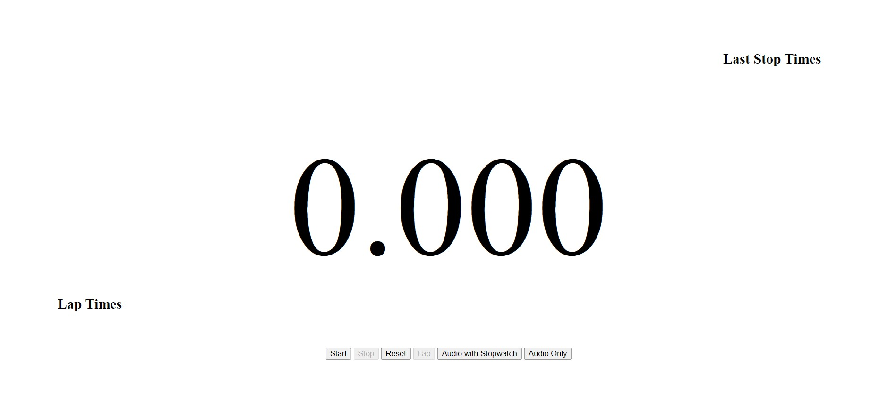
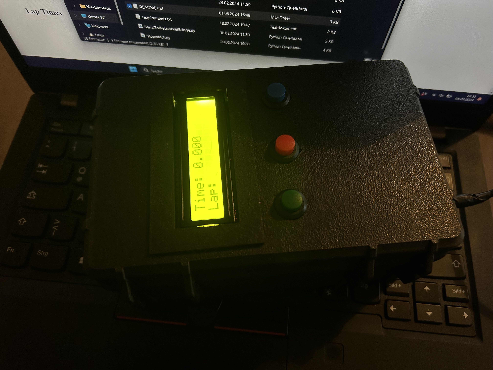

# ESP32 Stopwatch

This project contains a C++ program designed for ESP32 microcontroller boards, specifically tested on the AZ-Delivery Devkit v4, programmed using PlatformIO in Visual Studio Code. The program turns the ESP32 into a stopwatch, utilizing buttons and a 16x2 I²C LCD display.

## Functionality

The stopwatch operates in two modes:

1. **Local Stopwatch Mode**: When powered by a battery, the ESP32 functions as a standalone stopwatch. Users can control the stopwatch directly using the buttons connected to the ESP32.

2. **Remote Stopwatch Mode**: When connected to a PC via USB, the ESP32 acts as a remote control for a stopwatch running on the PC. The ESP32 sends serial commands to the PC, allowing users to control the stopwatch on the PC using the buttons on the ESP32. This requires a separate stopwatch program running on the PC.

## Getting Started

To utilize the functionality of the ESP32 Stopwatch, follow these steps:

1. Connect the ESP32 to a power bank battery to use it as a standalone stopwatch or connect it to a PC via USB to enable remote control functionality. If connected to a PC via USB and you want to use the stopwatch written in python, press the start button while connecting to the USB.

2. If using the remote control functionality, ensure you have the required Python environment set up on your PC.

3. Run the Python stopwatch program (`Bewerbstimer.py`) located in the repository. This will start a web server accessible at `http://localhost:5000`.

4. If the ESP32 is connected to the PC and the connection is successful, the stopwatch on the PC can be controlled via the buttons on the ESP32.

## File Structure

- `ESP32_Stopwatch/`: Contains the ESP32 stopwatch program.
- `Bewerbstimer.py`: Python program for the stopwatch running on the PC.
- `esp32_stopwatch.jpg`: Image demonstrating the ESP32 setup.
- `python_stopwatch.jpg`: Image demonstrating the stopwatch reachable via browser.

## Usage

- To use the ESP32 as a standalone stopwatch, power it using a battery and interact with the buttons connected to it.
- To use the ESP32 as a remote control for the stopwatch on the PC, ensure it is connected to the PC via USB and run the `Bewerbstimer.py` Python program. 

## Dependencies

- This project relies on PlatformIO for ESP32 development.
- The Python stopwatch program requires several python libraries. Install dependencies using `pip install -r requirements.txt`.

